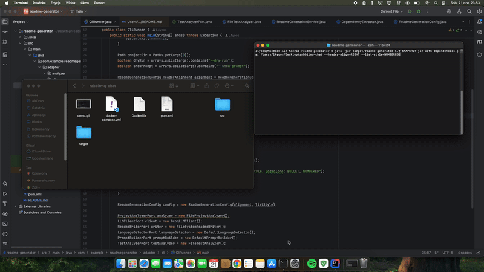

<h1 align="left">readme-generator 📄</h1>

A Java-based README file generator that uses a Large Language Model (LLM) to generate high-quality README files for projects.

  
  
  

<h2 align="left">🚀 Overview</h2>

The readme-generator is a Java-based project that uses a Large Language Model (LLM) to generate high-quality README files for projects. The project uses Maven for building and testing, and includes a range of dependencies for language detection, testing, and LLM functionality.

<ul align="left">
  <li>Generates high-quality README files for projects</li>
  <li>Uses a Large Language Model (LLM) for natural language processing</li>
  <li>Includes dependencies for language detection, testing, and LLM functionality</li>
</ul>

<h2 align="left">📦 Built With</h2>

The following dependencies were used in the development of the readme-generator:

<ul align="left">
  <li>org.json:json (20240303)</li>
  <li>org.junit.jupiter:junit-jupiter (RELEASE)</li>
  <li>org.mockito:mockito-core (5.10.0)</li>
  <li>com.github.stefanbirkner:system-lambda (1.2.1)</li>
  <li>org.apache.maven.plugins:maven-compiler-plugin (3.8.1)</li>
  <li>org.apache.maven.plugins:maven-assembly-plugin (3.3.0)</li>
</ul>

<h2 align="left">📚 Table of Contents</h2>

The readme-generator includes the following components:

<ul align="left">
  <li>ReadmeGenerationService</li>
  <li>GroqLLMClient</li>
  <li>FileSystemReadmeWriter</li>
  <li>CliRunner</li>
  <li>DefaultLanguageDetector</li>
  <li>FileProjectAnalyzer</li>
  <li>FileTestAnalyzer</li>
  <li>ReadmeGenerationConfig</li>
  <li>DependencyExtractor</li>
</ul>

<h2 align="left">✅ Prerequisites</h2>

To use the readme-generator, you will need to have the following installed:

<ul align="left">
  <li>JDK 17</li>
  <li>Maven</li>
</ul>

<h2 align="left">🛠️ Installation</h2>

To install the readme-generator, you can use the following command:

<ul align="left">
  <li>mvn clean package</li>
</ul>

<h2 align="left">🚀 Usage</h2>

To use the readme-generator, you can run the following command:

<ul align="left">
  <li>java -jar target/readme-generator.jar</li>
</ul>

<h2 align="left">🧪 Testing</h2>

The readme-generator includes a range of tests using JUnit and Mockito:

<ul align="left">
  <li>ReadmeGenerationServiceTest</li>
  <li>GroqLLMClientTest</li>
  <li>FileSystemReadmeWriterTest</li>
  <li>CliRunnerTest</li>
  <li>DefaultLanguageDetectorTest</li>
  <li>FileProjectAnalyzerTest</li>
  <li>FileTestAnalyzerTest</li>
  <li>ReadmeGenerationConfigTest</li>
  <li>DependencyExtractorTest</li>
</ul>

<h2 align="left">🎬 Demo</h2>

  

